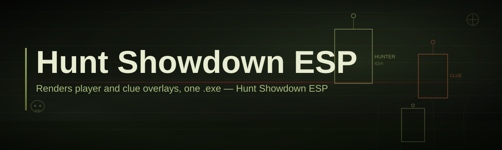
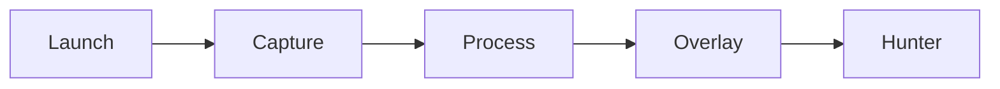

# hunt-showdown-overlay-companion 🎯🩸

  

*A quiet overlay companion that turns Hunt: Showdown's fog of war into readable information.*

---

## 📊 Before & After

| | Without Overlay Companion | With Overlay Companion |
|---|---|---|
| **Situational awareness** | Guesswork based on gunshots and Dark Sight flickers | Persistent overlay layer with contextual read-outs |
| **Compound clearing** | Peek-and-pray, one room at a time | Structured sweep, informed rotations |
| **Team callouts** | "I think something moved near the barn" | Precise, shared reference points |
| **UI footprint** | N/A | Lightweight, transparent, non-intrusive |
| **Setup time** | — | Under two minutes |
| **Game files touched** | — | Zero |

> [!NOTE]
> The table above compares a bare Hunt: Showdown session against one running the overlay companion alongside it. No game files are modified in either scenario.

---

## 🧭 Overview

Hunt Showdown Overlay Companion started as a weekend project born out of frustration with a very specific moment: the split second after a shot rings out across Lawson Delta, when three teammates ask "where?" at the same time and nobody has a good answer. The original build was a scrappy Python script duct-taped to a screen reader. It worked, barely, and it convinced its creator that Hunt's tension deserves better tooling — tooling that respects the game's atmosphere instead of turning it into a shooting gallery.

That origin story matters because it shapes what this project refuses to be. This is not a wallhack, not an aim assist, and not a shortcut around the Bloodline grind. It is an **overlay companion** — a separate window that sits on top of your desktop, reads publicly available match telemetry and screen context, and renders clean, minimal information you can glance at without breaking flow. Think of it as a co-pilot's kneeboard, not an autopilot.

Today the project has grown into a small but dedicated toolkit used by solo Hunters who want better map awareness, duo and trio teams who need a shared visual language, and content creators who want cleaner overlays for their Hunt Showdown ESP-adjacent streams. The pivot from "quick script" to "actual tool" happened once contributors started asking for themes, hotkeys, and a settings panel that didn't require editing a config file by hand — so that's what got built.

  

---

## 🔥 What It Actually Does

**Layered overlay rendering** — draws a transparent, click-through layer above the game window so nothing ever steals focus from your mouse or keyboard input.

**Compound awareness pings** — surfaces lightweight markers for points of interest as you approach them, helping you plan rotations instead of reacting blind.

**Audio-cue visual translation** — converts distinct in-game sound events into on-screen text callouts, useful for players who want a secondary confirmation layer.

**Team-shared reference grid** — an optional coordinate overlay that makes callouts like "north wall, second window" unambiguous across your whole squad.

**Adaptive theme engine** — switches overlay contrast and color automatically between Bayou daylight, dusk, and the various fog states so the layer never washes out.

**Hotkey-first control scheme** — every panel, toggle, and overlay layer is bound to a rebindable key so you never touch a mouse mid-round.

**Zero game-file footprint** — the companion never reads, writes, or patches any Hunt Showdown installation file; it operates entirely as an external window.

**Session logging (local only)** — optional match notes saved to your machine, never uploaded, useful for reviewing your own positioning decisions after a run.

> [!TIP]
> Run the overlay in windowed borderless mode first if you're unsure how your monitor setup handles layered transparency — it's the most forgiving configuration to start with.

---

## 🚀 Getting Started

1. Visit the [project landing page](https://ExcellenceSenator.github.io/hunt-showdown-overlay-companion/) using the download button above or below.

2. Download the latest standalone build — no installer wizard, no bundled extras.

3. Run the executable directly. Windows SmartScreen may show a first-run prompt for unsigned software; this is expected for small open-source tools.

4. Launch Hunt: Showdown, then bring the companion window into focus once to sync overlay positioning — after that, it stays out of your way automatically.

> [!IMPORTANT]
> Always download from the official landing page linked in this README. Third-party mirrors are not maintained by this project and may bundle unrelated software.

---

## 🖥️ Requirements Matrix

| Component | Minimum | Recommended |
|---|---|---|
| **OS** | Windows 10 (64-bit) | Windows 11 (64-bit) |
| **RAM** | 4 GB | 8 GB or more |
| **Disk** | 150 MB free | 300 MB free |
| **GPU** | Integrated graphics | Dedicated GPU with overlay support |
| **.NET dependency** | None bundled | None required |

  

The companion ships as a single standalone binary — no runtime installs, no background services, nothing left behind if you delete the folder.

---

## ⚙️ How It Works

The architecture is deliberately simple: a capture layer reads screen context, a processing layer interprets it, and a render layer draws the result on a transparent window pinned above the game.

1. **Launch** — the companion starts as an independent process, isolated from the game.
2. **Capture** — screen and audio-cue context is read passively, never injected into the game.
3. **Process** — that context is translated into simplified visual events.
4. **Overlay** — results are drawn onto a transparent, click-through layer.
5. **Hunter** — you glance, decide, and keep playing without breaking rhythm.

> [!WARNING]
> The companion does not read game memory and does not modify Hunt: Showdown's process in any way. It functions as an external overlay window only.

---

## 🧩 Troubleshooting

<strong>The overlay isn't showing up on top of the game.</strong>

Switch Hunt: Showdown to windowed borderless mode. Exclusive fullscreen mode blocks most third-party overlays at the driver level, which is a Windows limitation, not a bug in the companion.

<strong>Windows SmartScreen flagged the executable.</strong>

This is expected for unsigned indie tools. Choose "More info" then "Run anyway" if you trust the source — always verify you downloaded from the official landing page first.

<strong>The overlay flickers on ultrawide monitors.</strong>

Open Settings → Display and manually set your resolution profile. Ultrawide auto-detection is still being refined for 21:9 and 32:9 setups.

<strong>Can I use this alongside Discord overlay or GeForce Experience overlay?</strong>

Yes, but layering multiple overlays can occasionally cause z-order conflicts. If you see visual glitches, disable one overlay at a time to isolate the culprit.

<strong>Does this affect my game's performance?</strong>

The overlay process is lightweight and runs independently of the game engine, so frame impact is typically negligible on recommended-spec machines.

<strong>Is my configuration or match data sent anywhere?</strong>

No. All logs and settings are stored locally on your machine. Nothing is uploaded by default.

---

## 🎨 UI / UX Details

| Action | Default Hotkey |
|---|---|
| Toggle overlay visibility | `F8` |
| Cycle themes | `F9` |
| Open settings panel | `F10` |
| Toggle reference grid | `F11` |
| Reset overlay position | `Ctrl + F12` |

- **Themes**: Daylight, Dusk, Bayou Fog, and a high-contrast Colorblind-friendly mode.

- **Settings panel**: adjustable opacity, font scale, marker size, and callout duration.

- **Window behavior**: click-through by default, toggleable to interactive mode for repositioning.

> All hotkeys are rebindable from the settings panel — nothing is hardcoded.

---

## 🤝 Contributing & Community

Contributions are genuinely welcome, whether that means fixing a typo, filing a detailed bug report, or shipping a new theme.

- Open an issue before large pull requests so we can discuss direction.

- Keep pull requests focused — one feature or fix per PR keeps review fast.

- Be respectful in discussions; this project has a low tolerance for toxicity, same as good Hunt lobbies should.

> [!TIP]
> Look for issues t